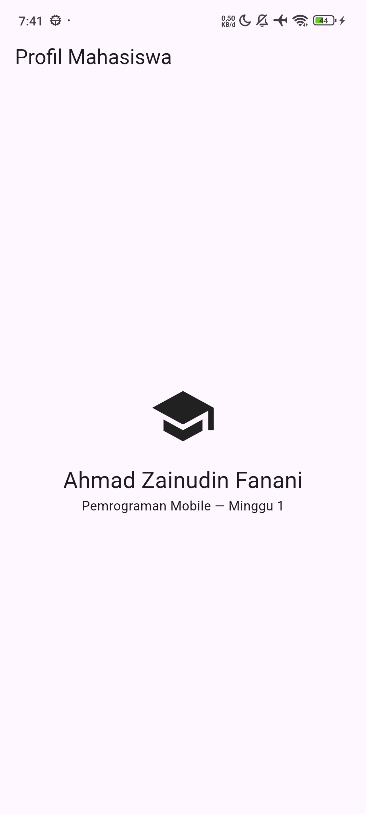
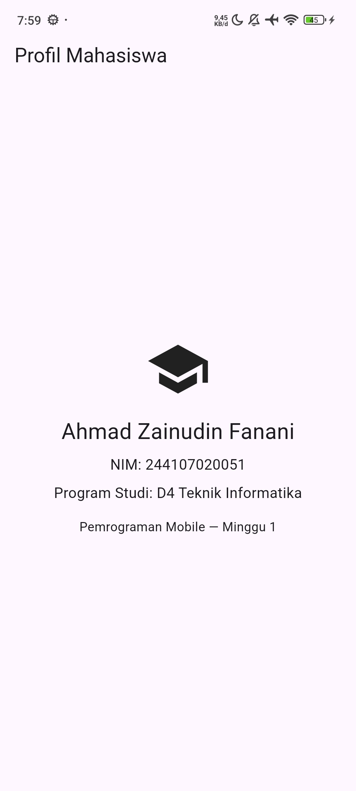

# Laporan Praktikum Minggu 1: Profil Mahasiswa

**Nama  :** Ahmad Zainudin Fanani  
**NIM   :** 244107020051  

---

## Kendala Setup & Instalasi
Selama proses instalasi dan menjalankan aplikasi untuk pertama kalinya, terdapat dua kendala utama yang saya temui:

1. **Gradle Build Timeout** 
   * **Masalah:** Terjadi *error* `Timeout waiting to lock build logic queue`. 
   * **Solusi:** Menghentikan proses Gradle yang berjalan di latar belakang (melalui Task Manager) atau menghapus file `buildLogic.lock` secara manual.
2. **Android NDK Corrupt** 
   * **Masalah:** Muncul pesan *error* `NDK did not have a source.properties file`. 
   * **Solusi:** Menghapus folder NDK versi tersebut di direktori `%localappdata%\Android\sdk\ndk` agar sistem Flutter/Gradle mengunduh ulang file NDK yang utuh secara otomatis. Selain itu, perlu mengaktifkan opsi "Install via USB" pada Developer Options (HP Xiaomi) agar aplikasi berhasil diinstal ke perangkat asli.
3. **Android v1 Embedding Deleted**
   * **Masalah:** Muncul pesan *error* `Build failed due to use of deleted Android v1 embedding.` saat mencoba melakukan *build*.
   * **Solusi:** Menjalankan perintah `flutter create .` pada root proyek untuk meregenerasi file konfigurasi Android terbaru (menggunakan embedding v2) tanpa menghilangkan file kode utama `lib/main.dart`.

---

## Refleksi Pembelajaran

### 1. Kapan pengembangan *native* lebih direkomendasikan dibanding *cross-platform*?
Pengembangan *native* lebih disarankan ketika aplikasi membutuhkan kriteria berikut:
* **Performa Menjadi Prioritas:** Aplikasi membutuhkan komputasi berat, animasi yang sangat kompleks, atau tingkat *framerate* yang tinggi (seperti *game* 3D tingkat lanjut).
* **Eksplorasi Hardware Mendalam:** Membutuhkan akses tingkat rendah (*low-level*) ke sensor keras (*hardware*) spesifik perangkat yang belum sepenuhnya didukung oleh *plugin cross-platform*.
* **Adopsi Fitur OS Terbaru:** Aplikasi menuntut integrasi langsung dengan fitur atau API terbaru pada hari pertama peluncuran sistem operasi (iOS/Android) versi terbaru.
* **Efisiensi Penyimpanan:** Proyek menargetkan ukuran *file* (APK/AAB/IPA) sekecil mungkin, karena aplikasi *native* tidak memerlukan mesin *framework* tambahan seperti Flutter/React Native di dalamnya.

### 2. Bagaimana perubahan *state* memengaruhi *widget tree* pada konsep UI deklaratif?
Pada paradigma UI deklaratif, tampilan layar adalah hasil proyeksi langsung dari data (*state*) yang ada. 
* **Proses:** Berbeda dengan konsep imperatif (di mana elemen UI diubah manual satu per satu), pada UI deklaratif kita hanya perlu memperbarui nilainya (*state*). Ketika *state* tersebut diperbarui, Flutter secara otomatis menghitung perbedaannya dan menyusun ulang (*rebuild*) struktur *widget tree* di latar belakang untuk merender tampilan baru yang sesuai dengan data terkini.

### 3. Mengapa *commit* yang kecil dan berpesan jelas sangat penting untuk tim dan portofolio?
* **Kolaborasi Tim:** *Commit* dengan cakupan kecil membuat proses *code review* menjadi lebih cepat dan meminimalisir bentrok kode (*merge conflict*). Jika ditemukan *bug*, tim dapat melacak dan membatalkan (*revert*) spesifik pada bagian yang bermasalah saja tanpa merusak keseluruhan fitur.
* **Nilai Portofolio:** Riwayat *commit* yang rapi dan deskriptif berfungsi sebagai etalase cara berpikir (*mindset*) seorang *programmer*. Rekruter atau *Tech Lead* dapat melihat bahwa pembuatnya bekerja secara terorganisir, sistematis, dan siap beradaptasi dengan standar industri kerja.

---

## Dokumentasi Hasil

| Tampilan Hasil Awal | Mini Assignment |
| :---: | :---: |
|  |  |