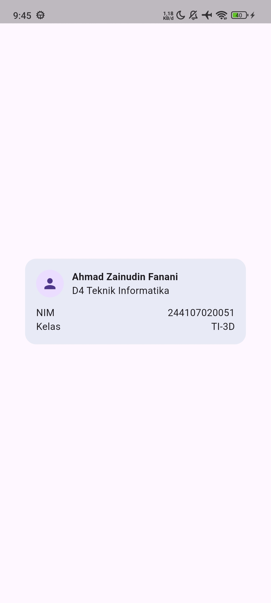
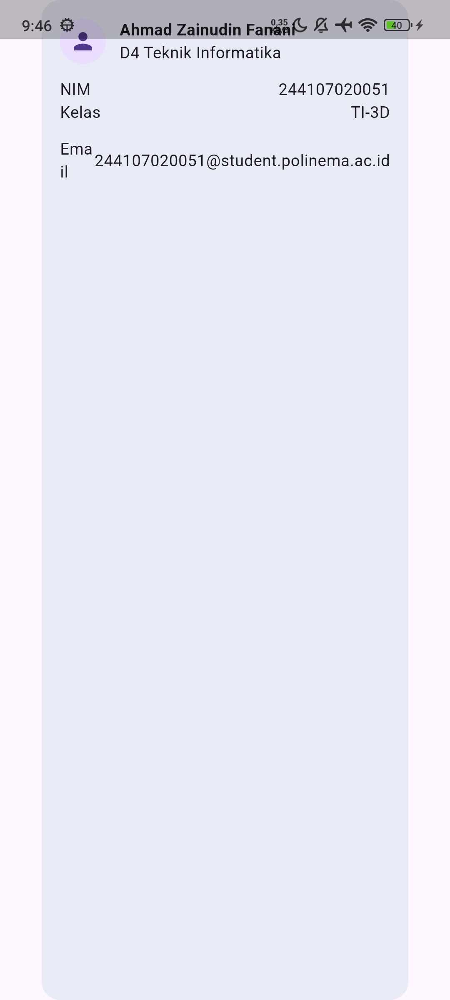
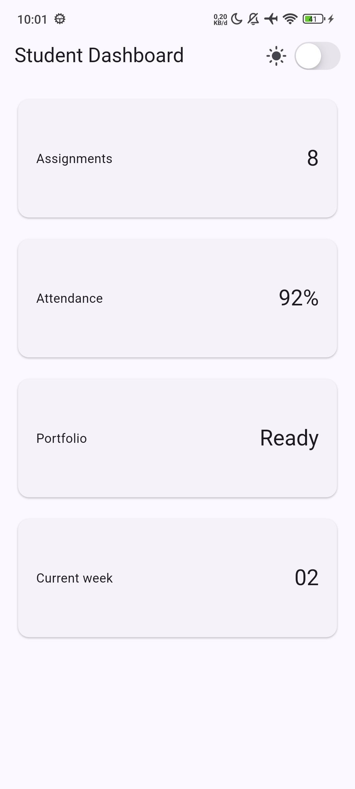
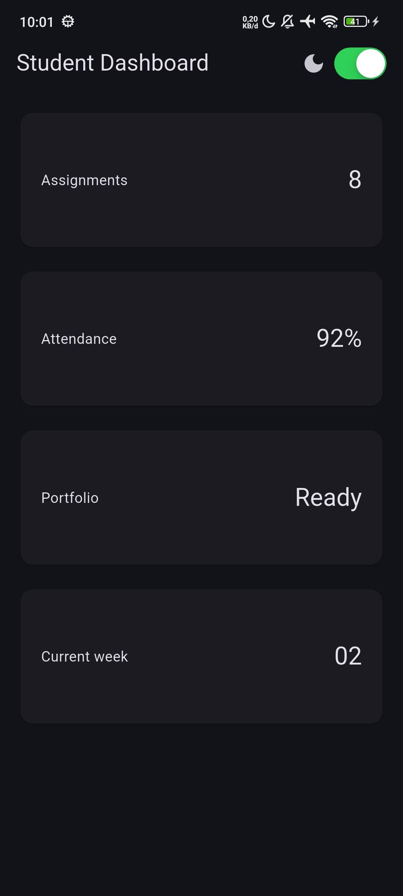
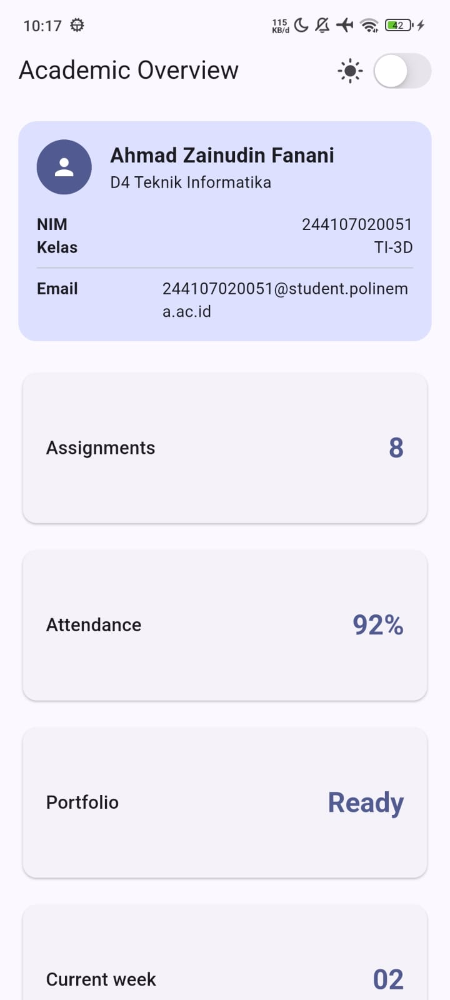
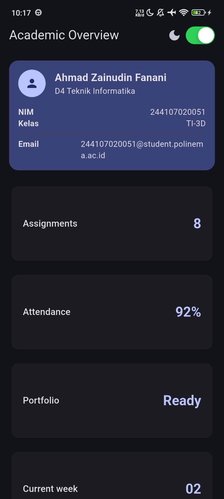
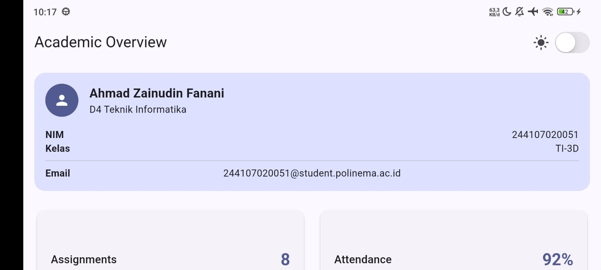
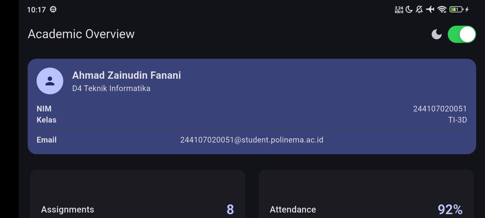

# Laporan Praktikum Minggu 2: Declarative UI & Responsive Design

**Nama  :** Ahmad Zainudin Fanani  
**NIM   :** 244107020051  
**Kelas :** TI-3D  

---

## AI Design Exploration Challenge

### 1. Prompt Desain: GridView vs LayoutBuilder + Column
**Prompt:** Bandingkan dua tata letak dashboard akademik untuk Flutter: versi GridView dan versi LayoutBuilder + Column. Jelaskan trade-off responsif dan aksesibilitasnya.

**Jawaban/Analisis:**
- **GridView:**
  - **Responsif:** Sangat baik untuk tampilan *grid* karena menyediakan parameter `crossAxisCount` yang bisa diubah secara dinamis melalui `LayoutBuilder` (seperti yang kita gunakan: 1 kolom di layar sempit, 2 kolom di layar lebar).
  - **Aksesibilitas:** Jika item di dalam *grid* berurutan, *screen reader* (pembaca layar) akan membacanya baris per baris.
  - **Trade-off:** Lebih mudah ditulis untuk item berukuran seragam, tetapi kurang fleksibel jika ada *card* yang harus lebih tinggi atau lebih lebar dari yang lain.
- **LayoutBuilder + Column/Row:**
  - **Responsif:** Memberikan kontrol penuh. Kita bisa menggunakan `Column` di layar kecil dan beralih ke `Row` (dengan `Expanded`) di layar besar.
  - **Aksesibilitas:** Lebih linier dan lebih mudah dikontrol urutan semantiknya.
  - **Trade-off:** Kodenya lebih panjang dan membutuhkan logika kondisional yang lebih kompleks.

**Keputusan:** Kami menggunakan `GridView.count` karena kartu informasi memiliki ukuran yang seragam, sehingga lebih elegan jika dibungkus dalam *Grid*.

### 2. Prompt Penguatan Konsep: Expanded dan Overflow
**Prompt:** Jelaskan kapan penggunaan `Expanded` justru menyebabkan overflow di dalam `Row`, beri contoh kode yang gagal dan perbaikannya.

**Jawaban/Analisis:**
- `Expanded` memaksa *child*-nya untuk mengisi *sisa* ruang kosong.
- **Penyebab Overflow:** Jika `Expanded` ditempatkan di dalam wadah yang lebarnya tidak terbatas (*unconstrained width*), misalnya di dalam `SingleChildScrollView` horizontal, `Expanded` meminta lebar tak terhingga dan terjadilah *error*.

**Contoh Gagal:**
```dart
SingleChildScrollView(
  scrollDirection: Axis.horizontal,
  child: Row(
    children: [
      Text('Label'),
      // ERROR: Expanded tidak tahu berapa batas layar karena bisa di-scroll tanpa batas
      Expanded(child: Text('Value panjang')),
    ],
  ),
)
```

### 3. Verification Prompt
**Prompt:** Periksa kembali rekomendasi layout di atas: apakah tetap responsif di bawah 600px, apakah mengurangi aksesibilitas, dan apakah ada widget yang tidak tersedia di Flutter stabil saat ini?

**Jawaban/Analisis:**
1. **Responsivitas < 600px:** Tetap responsif. Konstanta `kWideBreakpoint` diatur pada `700`. Jadi pada layar sempit, *layout* akan turun menjadi 1 kolom.
2. **Aksesibilitas:** Kami menambahkan atribut `Semantics` pada tombol *Toggle Dark Mode* agar lebih jelas saat dibaca oleh *screen reader*.
3. **Widget Flutter Stabil:** Seluruh widget yang digunakan merupakan bagian dari versi Flutter Stable terbaru.

---

## Refleksi Pembelajaran (Tahap 7)

### 1. Apa perbedaan cara berpikir imperative dan declarative saat membangun UI?
* **Imperative:** Kita harus memberikan instruksi langkah demi langkah tentang *bagaimana* UI harus diubah (misal: `textView.setText("Hello")`).
* **Declarative (Flutter):** Kita mendeskripsikan *seperti apa* UI seharusnya terlihat berdasarkan kondisi (*state*) saat ini. Jika datanya berubah, Flutter akan secara otomatis membangun ulang (rebuild) tampilan UI tersebut (contoh: `Text(teksVariabel)`).

### 2. Kapan Expanded membantu dan kapan penggunaannya justru menghasilkan layout error?
* **Membantu:** Ketika kita ingin sebuah elemen mengambil seluruh *sisa* ruang kosong yang tersedia agar layout terlihat rapi dan proporsional (seperti menekan teks Email agar tidak bertabrakan dengan isinya).
* **Menghasilkan Error:** Ketika `Expanded` berada di dalam *parent* yang tidak memiliki batasan ukuran pasti (*unconstrained*), seperti di dalam `SingleChildScrollView` atau `ListView`. Karena ukuran *parent* dianggap tidak terbatas, `Expanded` akan menuntut ruang tak terhingga dan menyebabkan *overflow*.

### 3. Bagaimana breakpoint dan theme memengaruhi pengalaman pengguna?
* **Breakpoint:** Memastikan tata letak aplikasi beradaptasi dengan nyaman di berbagai ukuran perangkat. Aplikasi tidak terlihat "kosong melompong" di layar tablet (berubah jadi 2 kolom), dan tidak terlihat "berdesakan" di layar HP (menjadi 1 kolom).
* **Theme:** Memberikan kenyamanan visual, terutama fitur *Dark Mode* yang mengurangi ketegangan mata pengguna di lingkungan yang redup/gelap, sekaligus menghemat baterai pada layar OLED.

### 4. Apa yang Anda verifikasi dari rekomendasi AI setelah tugas inti selesai?
Saya memverifikasi tiga hal utama: 
1. **Fungsionalitas & Bebas Error:** Menguji dengan `flutter analyze` dan menjalankan *widget test* untuk memastikan rekomendasi kode tidak memicu masalah baru.
2. **Responsivitas Nyata:** Mencoba langsung memutar orientasi layar dan mengecilkan jendela untuk melihat kebenaran logika *breakpoint* AI.
3. **Aksesibilitas:** Memastikan atribut tambahan seperti `Semantics` yang disarankan AI benar-benar relevan dan diletakkan pada komponen interaktif yang tepat (seperti `CupertinoSwitch`).

---

## Dokumentasi Hasil

### 1. Tahap 4: Profil Dasar & Eksperimen Overflow
| Profil Dasar | Eksperimen Overflow |
| :---: | :---: |
|  |  |

### 2. Tahap 5: Grid Layout & Interaksi Tema
| Grid (Light Mode) | Grid (Dark Mode) |
| :---: | :---: |
|  |  |

### 3. Tahap 6: Academic Overview (Final)
| Portrait (1 Kolom, Light Mode) | Portrait (1 Kolom, Dark Mode) |
| :---: | :---: |
|  |  |

| Landscape (2 Kolom, Light Mode) | Landscape (2 Kolom, Dark Mode) |
| :---: | :---: |
|  |  |
