# Laporan Praktikum Minggu 3: Navigation & State Management

**Nama  :** Ahmad Zainudin Fanani  
**NIM   :** 244107020051  
**Kelas :** TI-3D  

---

## AI Challenge & Verification Checklist

### 1. Verification Checklist Hasil AI (StatsPage & Notifier)

| No | Kriteria Verifikasi | Status | Penjelasan / Temuan |
| :-: | :--- | :-: | :--- |
| 1 | **Immutability State** | ✅ Pass | Data `StatItem` menggunakan `final` dan list diperbarui dengan mengembalikan list baru (`AsyncData`), tanpa mutasi langsung (`state.add()`). |
| 2 | **Penggunaan `ref.watch` vs `ref.read`** | ✅ Pass | `ref.watch` HANYA digunakan di dalam method `build()` untuk mendengarkan perubahan state, sedangkan `ref.read` digunakan di handler tombol (`onPressed`). |
| 3 | **Penanganan `AsyncValue` Lintas State** | ✅ Pass | Menggunakan `statsAsync.when()` yang secara eksplisit menangani 3 kondisi: `loading` (spinner), `error` (pesan + tombol retry), dan `data` (ListView). |
| 4 | **Tipe Provider Eksplisit** | ✅ Pass | Dideklarasikan secara jelas menggunakan `AsyncNotifierProvider<StatsNotifier, List<StatItem>>`. |
| 5 | **Riverpod API Modern** | ✅ Pass | Menggunakan pola terbaru `AsyncNotifier` dan `ConsumerWidget`, tanpa menggunakan API usang seperti `StateNotifierProvider` atau `StateProvider`. |
| 6 | **Bebas Warning & Lolos Test** | ✅ Pass | `flutter analyze` menghasilkan **No issues found!** dan seluruh unit/widget test **Lulus (100% Passed)**. |

---

## Refleksi Pembelajaran

### 1. Kapan `setState` masih cukup, dan kapan state harus naik ke Riverpod?
* **`setState` Cukup:** Digunakan untuk state lokal yang sifatnya sementara dan hanya berdampak pada satu widget tertentu saja. Contohnya: status membuka/menutup dialog lokal, efek animasi tombol, atau pengontrol input teks sementara (`TextEditingController`).
* **Harus Naik ke Riverpod:** Digunakan ketika state perlu diakses atau diubah oleh banyak widget/halaman yang berbeda (misalnya daftar ToDo yang ditampilkan di halaman utama dan statistik di halaman lain), atau ketika logika bisnis perlu dipisahkan dari UI agar mudah diuji (*unit testing*).

### 2. Apa perbedaan `context.go` dan `context.push`, dan kapan masing-masing tepat digunakan?
* **`context.go` (GoRouter Declarative):** Mengganti stack navigasi saat ini dengan path baru secara absolut berdasarkan definisi router. Cocok untuk navigasi utama (seperti berpindah tab di `NavigationBar` atau *redirect* halaman login ke *dashboard*).
* **`context.push` (Stack Push):** Menumpuk (*push*) route baru di atas stack yang sedang aktif tanpa mengganti route dasar. Cocok untuk membuka halaman *detail*, modal, atau alur transaksional sementara di mana pengguna dapat menekan tombol *back* untuk kembali ke halaman sebelumnya.

### 3. Bagaimana `AsyncValue` mencegah bug dibanding tiga boolean terpisah?
* Mengelola state asinkron dengan 3 boolean manual (`isLoading`, `hasError`, `isSuccess`) sangat rawan bug karena memungkinkan terjadinya kondisi yang tidak konsisten (misalnya `isLoading = true` sekaligus `hasError = true`).
* `AsyncValue<T>` Riverpod memodelkan ketiga kondisi tersebut dalam satu tipe *discriminated union* (`AsyncLoading`, `AsyncError`, `AsyncData`). Dengan pencocokan pola `when()`, pengembang dipaksa oleh *compiler* untuk menangani ketiga kondisi tersebut secara lengkap, sehingga mencegah bug berupa layar putih saat error terjadi.

### 4. Bagian mana dari hasil AI yang Anda perbaiki, dan mengapa?
* **Penanganan Error pada Unit Test:** AI awalnya membuat pengujian error pada `test/stats_notifier_test.dart` menggunakan `expectLater(..., throwsA(...))` yang mengalami *timeout* karena *future* Riverpod di-dispose saat status masih *loading*. Saya memperbaikinya dengan menangkap *future* menggunakan `try/catch` dan memeriksa `state.hasError == true` secara eksplisit setelah microtask selesai.
* **Integrasi `widget_test.dart`:** Saya menyesuaikan `widget_test.dart` agar membungkus `MyApp` dengan `ProviderScope` serta mensimulasikan navigasi tab melalui `NavigationBar` untuk memastikan pengujian UI berjalan sesuai dengan alur aplikasi nyata.

---

## Dokumentasi Hasil Praktikum

### 1. Tahap 2: Konsep Navigasi dan GoRouter (Praktikum 1)
| Halaman Home (SS 1) | Halaman Detail (SS 2) |
| :---: | :---: |
| 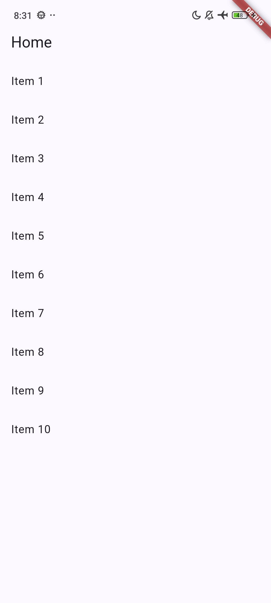 | 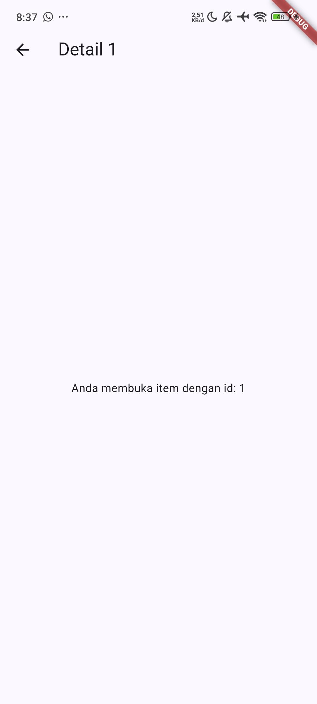 |

---

### 2. Tahap 3: State Management ToDo dengan Riverpod (Praktikum 2)
| Kondisi Awal (Kosong - SS 1) | Menambah Tugas (SS 2) | Tugas Selesai (Coret - SS 3) |
| :---: | :---: | :---: |
| 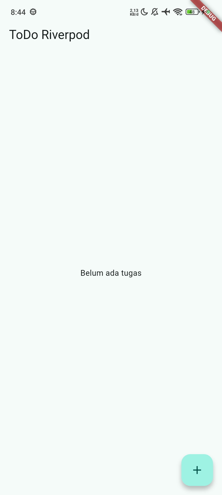 | 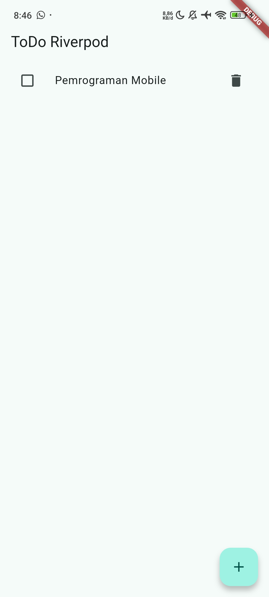 | 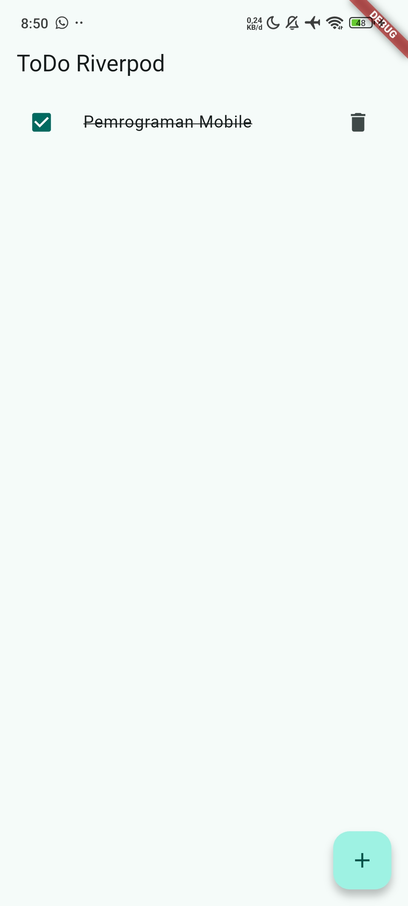 |

---

### 3. Tahap 4: AsyncValue Produk (Praktikum 3)
| State Loading (SS 1) | State Error & Retry (SS 2) | State Success Data (SS 3) |
| :---: | :---: | :---: |
| 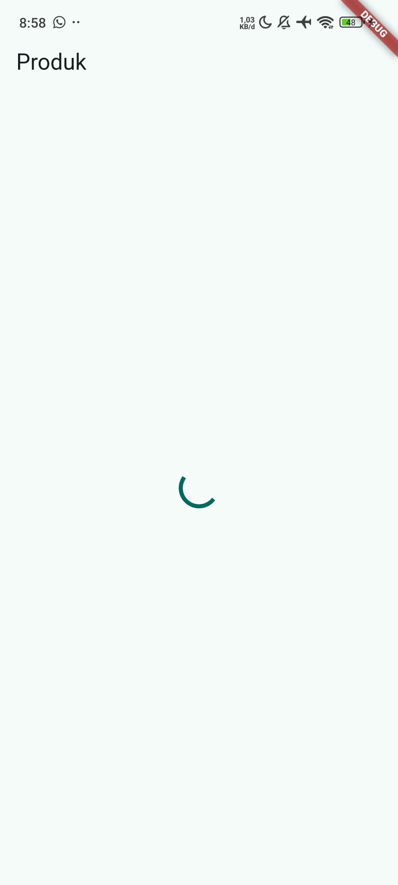 | 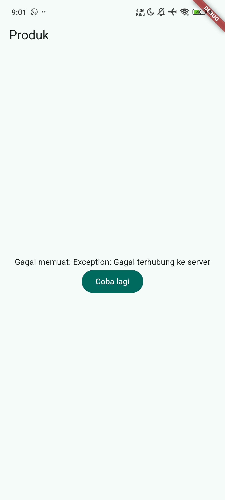 | 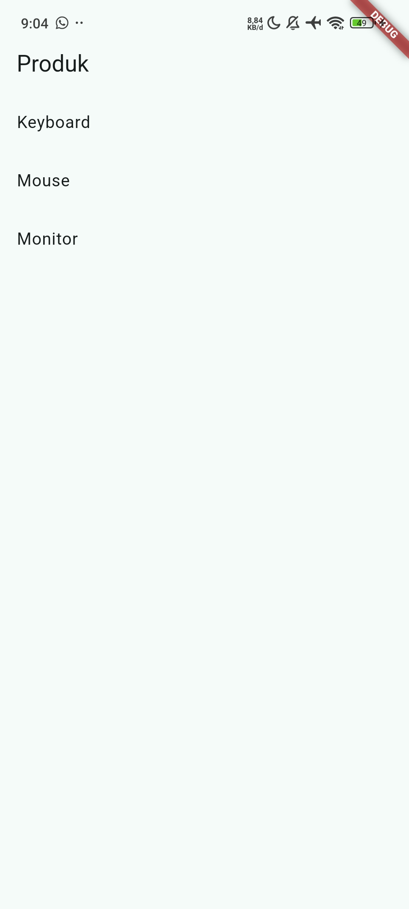 |

---

### 4. Tahap 5: AI Challenge (StatsPage, AsyncNotifier, Test & Analyze)
| State Loading (SS 1) | State Error & Retry (SS 2) | State Success 3 Item (SS 3) |
| :---: | :---: | :---: |
| 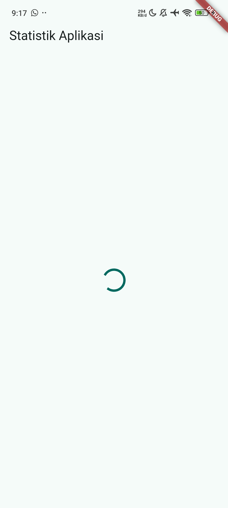 | 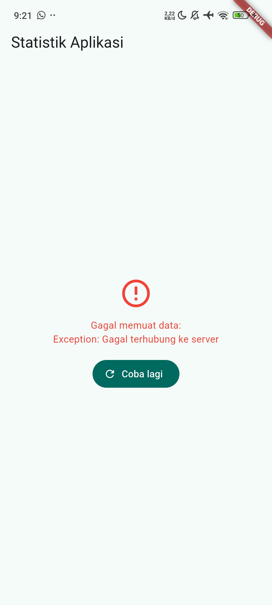 | 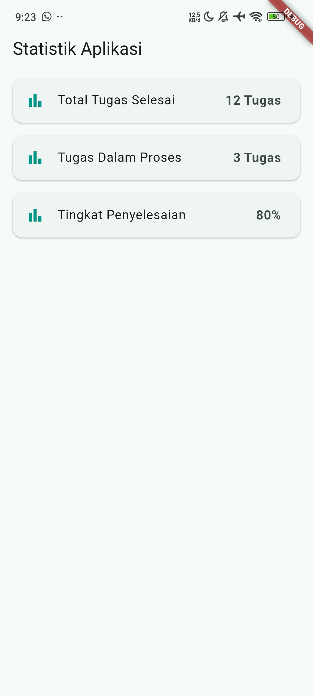 |

| Flutter Analyze (SS 4) | Flutter Unit & Widget Test (SS 5) |
| :---: | :---: |
| 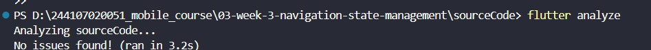 | 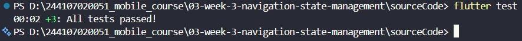 |

---

### 5. Tahap 6: Refactoring, Filter Provider, GoRouter Navigation & Final Test
| Navigasi ToDo & Stats via NavigationBar | Flutter Analyze Final | Flutter Test Final |
| :---: | :---: | :---: |
| 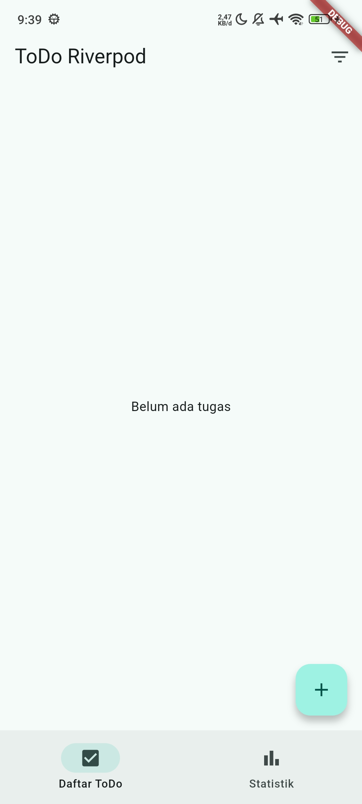 | 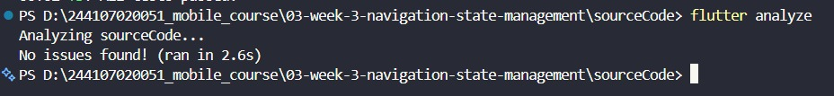 | 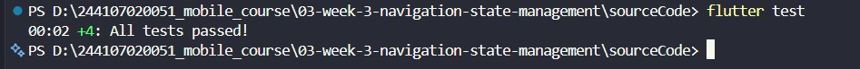 |
