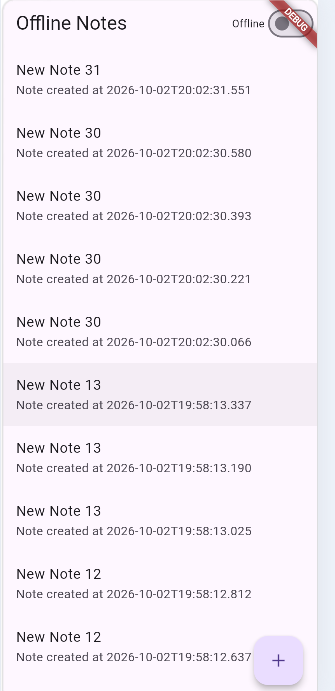
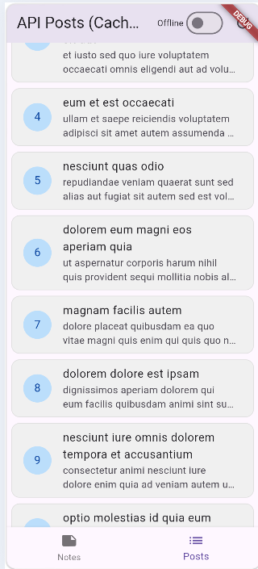
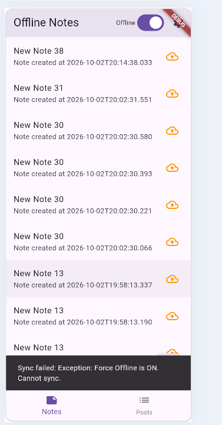
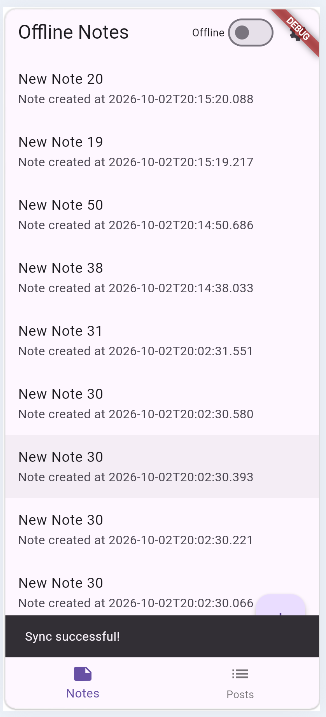
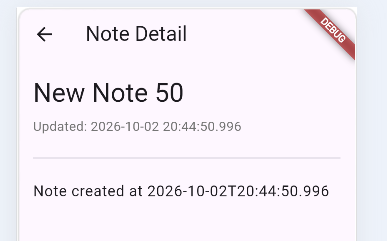
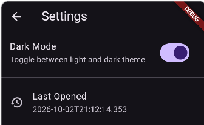

# Laporan Praktikum Minggu 5: Local Storage & Offline-First

## Objektif Pembelajaran
Pada modul ini, fokus utama adalah memahami dan mengimplementasikan penyimpanan lokal serta sinkronisasi data:
- Membedakan penggunaan *key-value storage*, *relational database*, dan *NoSQL* pada aplikasi mobile.
- Mengimplementasikan `SharedPreferences` untuk menyimpan konfigurasi ringan (contoh: preferensi tema dan riwayat buka aplikasi).
- Membangun operasi CRUD lokal menggunakan SQLite (`sqflite`) dengan pola *Repository*.
- Menerapkan arsitektur **Offline-First**: menggunakan *cache-first read*, *dirty flags* untuk antrean sinkronisasi.
- Mengelola *state* (loading, success, error, empty) dari data lokal menggunakan **Riverpod**.
- Melakukan *mocking* dan *unit testing* pada *local repository*.

---

## Fitur Utama Aplikasi
Aplikasi yang dikembangkan pada minggu ini memiliki beberapa kapabilitas utama:
1. **Offline-First Notes:** Operasi CRUD penuh secara lokal dengan SQLite.
2. **Posts Cache-First:** Menyimpan salinan data (cache) dari API sehingga tetap dapat dibaca saat offline.
3. **Mekanisme Sinkronisasi:** Penggunaan *dirty flag* untuk menandai data yang perlu disinkronkan ke server.
4. **Preferensi UI:** *Dark mode toggle* dan pencatatan akses terakhir aplikasi.
5. **Routing Modern:** Navigasi berbasis path menggunakan `GoRouter`.

---

## Konsep Arsitektur: Local-First vs Cache-First

Berikut adalah perbedaan mendasar dari kedua pendekatan yang diterapkan pada aplikasi:

| Aspek | Local-First (Modul Notes) | Cache-First (Modul Posts) |
| :--- | :--- | :--- |
| **Sumber Kebenaran (SoT)** | Database Lokal (SQLite) | Server (API), Lokal hanya salinan |
| **Kondisi Offline** | CRUD berjalan normal (baca & tulis) | Mode Read-Only (menampilkan cache lama) |
| **Arah Sinkronisasi** | *Push* / Upload ke server | *Pull* / Download dari server |
| **Penanganan Konflik**| Membutuhkan *dirty flag* dan resolusi konflik | Tidak relevan (Lokal hanya *mirroring*) |
| **Strategi Kode** | UI → Provider → Repository → SQLite | UI → Cache → Background Fetch API |

*Catatan: Pada modul Notes, ketiadaan internet tidak membatasi interaksi pengguna dengan datanya. Sementara pada modul Posts, ketersediaan internet diperlukan untuk mendapatkan data terbaru.*

<div align="center">

| Tampilan Notes | Tampilan Posts |
| :---: | :---: |
|  |  |

</div>

---

## Sistem Sinkronisasi & Penanda Data (Dirty Flag)

Aplikasi memiliki mekanisme sinkronisasi di latar belakang (*background sync*). 
- **Dirty = `true` (Belum Sinkron):** Saat pengguna membuat catatan baru tanpa internet, data disimpan secara lokal dan ditandai (biasanya dengan indikator visual) bahwa data tersebut belum masuk ke *remote server*.
- **Dirty = `false` (Tersinkronisasi):** Setelah koneksi kembali dan proses sinkronisasi berhasil, tanda *dirty* dicabut.

<div align="center">

| Status: Menunggu Sinkronisasi | Status: Sudah Tersinkronisasi |
| :---: | :---: |
|  |  |

</div>

---

## Hasil Eksplorasi AI Challenge: Analisis Solusi Local Storage

Untuk memenuhi tantangan ini, saya melakukan komparasi terhadap empat teknologi penyimpanan lokal di ekosistem Flutter: **SharedPreferences, Hive, sqflite, dan Drift**. Evaluasi ini difokuskan pada dua kebutuhan utama aplikasi: **Preferensi Tema** dan **CRUD Catatan**.

### 1. Perbandingan Karakteristik & Trade-off

| Parameter | SharedPreferences | Hive (NoSQL) | sqflite (SQLite) | Drift (ORM SQLite) |
| :--- | :--- | :--- | :--- | :--- |
| **Kompleksitas Query** | Sangat Terbatas (Hanya simpan/ambil *key-value* dasar). | Sedang. Filter dan pencarian harus dilakukan secara manual di level memori (Dart). | Tinggi. Mendukung eksekusi *raw SQL*, agregasi, dan klausa `WHERE` yang kompleks. | Sangat Tinggi. Menawarkan fungsionalitas SQL penuh dengan *query builder* berbasis Dart. |
| **Kebutuhan Relasi** | Tidak mendukung. | Terbatas (*HiveLists*), namun sulit untuk *query* lintas entitas. | Mendukung penuh konsep RDBMS (*Foreign Key*, *JOIN*). | Mendukung penuh RDBMS dengan keamanan *compile-time*. |
| **Reaktivitas (Stream)** | Tidak ada secara native. Membutuhkan bantuan *state management*. | Mendukung reaktivitas bawaan menggunakan `ValueListenable`. | Tidak ada. UI harus memanggil *query* ulang setelah modifikasi data. | Sangat Baik. Memiliki fitur `.watch()` untuk memperbarui UI otomatis saat ada mutasi data. |
| **Type-Safety** | Rendah (bisa memicu *runtime error* jika tipe data salah). | Tinggi (membutuhkan *TypeAdapter*). | Rendah. *Query* ditulis berupa String SQL yang rawan *typo*. | Sangat Tinggi. Validasi struktur tabel dan *query* dilakukan saat kompilasi (*compile-time*). |
| **Ukuran Boilerplate** | Sangat Minimalis. | Sedang. Memerlukan *code generation* (*build_runner*). | Tinggi. Membutuhkan penulisan *script* pembuatan tabel dan *mapping* manual (`toMap`, `fromMap`). | Sangat Tinggi. Harus menyiapkan *Data Classes*, *Tables*, dan *code generation* file `.g.dart`. |
| **Kemudahan Testing** | Mudah (`setMockInitialValues` tersedia). | Cukup Sulit. Butuh inisialisasi direktori penyimpanan khusus di *test environment*. | Sulit. Harus melakukan *mocking* pada native channel `sqflite_common_ffi`. | Mudah. Terdapat dukungan *in-memory database* secara native untuk unit test. |

### 2. Analisis Trade-off

- **SharedPreferences:** Unggul di kecepatan implementasi untuk data kecil, namun *trade-off*-nya adalah ketidakmampuan mengelola data terstruktur. Jika dipaksa untuk menyimpan *list* catatan panjang, aplikasi berpotensi mengalami *memory leak* karena seluruh data di-*load* bersamaan di awal.
- **Hive:** Menawarkan kecepatan baca/tulis yang superior karena beroperasi langsung di RAM. *Trade-off*-nya, konsumsi memori akan membesar seiring dengan bertambahnya jumlah catatan, dan fitur pencarian teks (Full-Text Search) kurang optimal dibandingkan SQL.
- **sqflite:** Menjadi fondasi yang sangat stabil dan hemat memori untuk ribuan data. *Trade-off* terbesarnya adalah *Developer Experience* (DX) yang kurang ramah karena mengharuskan penulisan *raw SQL* yang tidak memvalidasi *typo* sampai aplikasi dijalankan (*runtime*), serta ketiadaan *stream* otomatis.
- **Drift:** Menjawab seluruh kekurangan *sqflite* dengan menambahkan keamanan *compile-time* dan *stream* reaktif. *Trade-off*-nya adalah kurva pembelajaran yang lebih menantang dan waktu kompilasi (*build time*) tambahan akibat proses *code generation*.

### 3. Rekomendasi Arsitektur Final

| Kebutuhan Aplikasi | Rekomendasi Teknologi | Dasar Pertimbangan |
| :--- | :--- | :--- |
| **Preferensi Tema** | **SharedPreferences** | Data preferensi sangat statis dan ukurannya sangat kecil (misal `isDarkMode: true`). Menggunakan SQLite atau Hive untuk sekadar preferensi adalah sebuah tindakan *over-engineering* yang tidak praktis. |
| **CRUD Catatan** | **Drift** (atau **sqflite**) | Skalabilitas dan efisiensi memori adalah kunci untuk 1000+ data. Drift memastikan aplikasi tidak kehabisan RAM. Fitur reaktif (`.watch()`) dari Drift akan sangat membantu sinkronisasi *background*; ketika sinkronisasi mengubah status `dirty` menjadi `0`, UI akan bereaksi secara otomatis tanpa campur tangan manual. (Catatan: *sqflite* murni tetap menjadi alternatif yang solid jika developer ingin menghindari ketergantungan pada *build_runner*). |

### 4. Skema Database Optimal (Skala 1000+ Catatan)

Untuk mempertahankan performa responsif (terutama saat *scrolling* dan pencarian) pada skala ribuan catatan, skema tabel wajib menyertakan arsitektur pengindeksan (**INDEX**). Berikut adalah representasi skemanya:

```sql
CREATE TABLE notes (
  id INTEGER PRIMARY KEY AUTOINCREMENT,
  title TEXT NOT NULL,
  body TEXT NOT NULL DEFAULT '',
  updated_at TEXT NOT NULL,
  dirty INTEGER NOT NULL DEFAULT 0
);

-- Indeks Performa: Mengurutkan catatan dari yang terbaru (mempercepat query di layar utama)
CREATE INDEX idx_notes_updated_at ON notes(updated_at DESC);

-- Indeks Antrean Sinkronisasi: Mempercepat deteksi data yang butuh di-sync oleh background worker
CREATE INDEX idx_notes_dirty ON notes(dirty) WHERE dirty = 1;
```

**Alasan Desain Skema:**
Tanpa `idx_notes_dirty`, proses pengecekan catatan yang belum disinkronisasi akan memaksa SQLite melakukan *Full Table Scan* (memeriksa 1000+ baris satu per satu). Dengan indeks parsial (`WHERE dirty = 1`), pencarian antrean data *offline* dapat diselesaikan secara instan, sehingga hemat baterai perangkat. Pendekatan yang sama berlaku untuk `idx_notes_updated_at` yang mempercepat klausul *ORDER BY* saat aplikasi menampilkan daftar catatan.

### Apakah AI menempatkan daftar catatan di SharedPreferences? (menolak: rapuh untuk koleksi).

Tidak. Daftar catatan disimpan menggunakan **Drift/sqflite** karena lebih cocok untuk data yang jumlahnya dapat bertambah. Sedangkan **SharedPreferences** digunakan untuk data sederhana seperti preferensi tema gelap/terang dan ukuran font.

### Apakah skema AI mendukung antrean sync (dirty flag / updated_at) atau hanya CRUD polos?

Mendukung. Skema sudah memiliki kolom **`dirty`** dan **`updated_at`** yang dapat digunakan untuk menandai data yang perlu disinkronkan serta mencatat waktu terakhir data diperbarui.

### Apakah klaim "real-time" AI didukung stream (Drift/watch) atau hanya asumsi?

Didukung oleh fitur **stream dari Drift**, bukan sekadar asumsi. Drift menyediakan fungsi **`.watch()`** yang akan merespons ketika terjadi perubahan pada data di SQLite.

### Apakah estimasi boilerplate AI masuk akal setelah Anda mencoba instalasinya (flutter pub add + migrasi skema)?

Ya, estimasinya cukup masuk akal. Untuk menggunakan Drift diperlukan instalasi **`drift`**, **`build_runner`**, dan **`drift_dev`**, kemudian membuat class tabel, menjalankan code generation untuk menghasilkan file **`.g.dart`**, serta menyiapkan proses migrasi skema seperti **`onUpgrade`**.

### Keputusan final Anda beserta alasannya, boleh berbeda dari rekomendasi AI selama berargumen.

Saya **setuju dengan hasil rekomendasi AI** karena solusi tersebut sesuai dengan kebutuhan aplikasi dan memenuhi checklist verifikasi yang diberikan. Penggunaan database untuk menyimpan catatan dan SharedPreferences untuk menyimpan preferensi juga sudah sesuai dengan jenis datanya.


---

## Proses Refactoring & Peningkatan Kode

Untuk menjaga struktur kode agar tetap rapi, saya telah melakukan beberapa refaktorisasi:

### 1. Ekstrak Widget `NoteTile`
Baris catatan pada antarmuka utama diekstrak menjadi widget `NoteTile` tersendiri. Widget ini akan menampilkan *badge* atau indikator "belum tersinkron" apabila properti `dirty == true`. Widget ini diletakkan pada `lib/widgets/note_tile.dart` untuk menggantikan penggunaan `ListTile` mentah di `lib/pages/notes_page.dart`.

Contoh implementasi:
```dart
        data: (notes) {
          if (notes.isEmpty) {
            return const Center(child: Text('No notes yet.'));
          }
          return ListView.builder(
            itemCount: notes.length,
            itemBuilder: (context, index) {
              final note = notes[index];
              return NoteTile(
                note: note,
                onTap: () {
                  // TODO: implement note editing
                },
                onLongPress: () async {
                  if (note.id != null) {
                    await ref.read(noteRepositoryProvider).deleteNote(note.id!);
                    ref.invalidate(notesProvider);
                    ref.invalidate(dirtyCountProvider);
                  }
                },
              );
            },
          );
```

### 2. Pemisahan Logika Sinkronisasi (`sync.dart`)
Logika *cache posts* dan `syncNotes` dipisahkan ke dalam file `lib/data/sync.dart` agar Repositori tetap memegang prinsip Single Responsibility (fokus murni pada CRUD lokal).
- `lib/data/sync.dart`: Berisi `SyncService` (untuk push `syncNotes`), `PostsSyncService` (untuk `cache-first posts`), beserta `postsProvider`.
- `lib/data/repositories/post_repository.dart`: Hanya berisi operasi CRUD murni (`readCachePosts()` dan `replaceCachedPosts()`).

### 3. Halaman Detail Catatan dengan GoRouter
Menambahkan halaman detail catatan menggunakan `GoRouter` dengan *path* `/note/:id`. Data yang ditampilkan pada halaman detail dibaca langsung dari repositori lokal (*Single Source of Truth*), bukan diover oper dari halaman *list*.
- `lib/router.dart`: Berisi konfigurasi navigasi GoRouter.
- `lib/pages/note_detail_page.dart`: Berisi halaman detail yang di-supply oleh `noteDetailProvider` yang mengambil dari repositori (`NoteRepository.getNote(id)`).



---

## Unit Testing

Terdapat beberapa kendala di mana pengujian praktikum awal tidak lolos. Berikut adalah solusinya:

1. **Memperbaiki Error pada Provider:**
   - Menambahkan import `notes_page.dart` agar `notesProvider` dapat diakses di dalam file *test*.
   - Mengubah `fetchNotes()` dari melempar error *synchronous* (`throw`) menjadi fungsi asinkron `Future.error()`.
   - Membuat *provider* khusus pengujian yaitu `testNotesProvider` yang bersifat **non-autoDispose**.
   - Mengubah logika *test error* dengan menggunakan `container.listen` dan memeriksa secara langsung *property* `.error`, bukan menggunakan pengecekan tipe `isA<AsyncError>()`.

2. **Cakupan Fungsi Tes yang Diselesaikan:**
   - **`fromMap` aman terhadap field yang hilang:** Memastikan metode `Note.fromMap()` tidak *crash* meskipun field `body`, `updated_at`, atau `dirty` tidak ditemukan pada *map*; nilai *default* akan selalu disisipkan.
   - **Flag dirty bertahan pada serialisasi:** Memastikan bahwa konversi bolak-balik (Note → Map → Note) tetap dapat mempertahankan status *dirty* dengan tepat.
   - **Penyedia sukses dengan repositori palsu:** Memastikan `notesProvider` (autoDispose) dapat merespons repositori (mock) dan mengembalikan data `List<Note>` dengan benar.
   - **Kesalahan penyedia dengan repositori palsu:** Menggunakan `testNotesProvider` (non-autoDispose) untuk memverifikasi kemampuan menangkap kesalahan (error) dari repositori via pengecekan nilai `.error`.

---

## Proyek mini / Tantangan Industri

Sebagai fitur penutup berstandar industri, saya telah mengimplementasikan:
- **Pengaturan Persisten:** Beralih antara tema gelap/terang serta menyimpan data riwayat waktu aplikasi terakhir dibuka (menggunakan `SharedPreferences`), yang diimplementasikan pada halaman Pengaturan.
- **Dokumentasi Aturan Konflik:** Mendefinisikan dan mendokumentasikan aturan resolusi konflik secara eksplisit di dalam file `sync.dart`.

