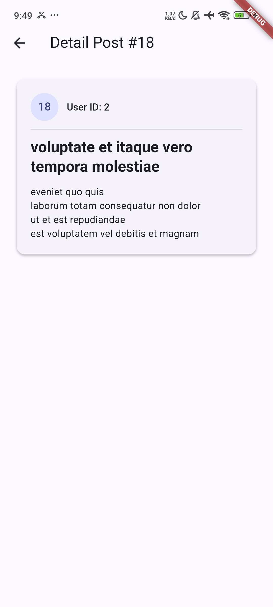

# Laporan Praktikum Week 4: Integrasi REST API, Dio, & State Management Riverpod

## Deskripsi & Capaian Pembelajaran

Pada praktikum Week 4 ini, telah diimplementasikan integrasi REST API pada aplikasi Flutter dengan arsitektur yang bersih (*clean architecture*) memisahkan **Model**, **Repository**, **State Management (Riverpod)**, dan **UI Layer**.

### Capaian Utama:
- **Konsep REST API & JSON Serialization**: Memetakan struktur data JSON dari [JSONPlaceholder](https://jsonplaceholder.typicode.com/) ke objek Dart secara aman terhadap nilai `null` (*null-safe defensive parsing*).
- **Penggunaan Dio HTTP Client**: Mengonfigurasi Dio secara terpusat untuk penanganan timeout, header request, dan interceptor.
- **Repository Pattern**: Mengisolasi logika komunikasi API dari UI Widget sehingga kode mudah dipelihara dan diuji.
- **State Management & Handling Errors**: Menggunakan Riverpod `AsyncValue` / `AsyncNotifier` untuk mengelola 4 kondisi UI: *Loading*, *Success*, *Empty*, dan *Error*.
- **Pagination (Infinite Scroll)**: Mengimplementasikan sistem muat data bertahap per halaman (*paginated fetching*) menggunakan `ScrollController`.
- **Refactoring & Navigasi Router**: Mengabaikan pemanggilan langsung di UI dengan ekstrak `PostTile`, pemisahan modul `network_errors.dart`, serta integrasi `GoRouter` untuk halaman detail (`/post/:id`).
- **Testing & Mock Repository**: Menguji unit test model, error handling, dan provider menggunakan `FakePostRepository` tanpa koneksi internet sungguhan.

---

## Arsitektur Kode & Implementasi Fitur

```
lib/
├── main.dart                      # Entry point dengan ProviderScope & GoRouter
├── data/
│   ├── api_client.dart            # Konfigurasi terpusat Dio Client
│   ├── network_errors.dart        # Fungsi friendlyErrorMessage yang reusable
│   ├── providers.dart             # Provider & Notifier utama (PostList & SinglePost)
│   ├── paged_posts.dart           # State & Notifier khusus Infinite Scroll
│   ├── comment_providers.dart     # Provider & Handler error (AI Challenge)
│   ├── models/
│   │   ├── post.dart              # Model Post dengan fromJson defensif
│   │   └── comment.dart           # Model Comment (AI Challenge)
│   └── repositories/
│       ├── post_repository.dart    # Repository untuk /posts dan /posts/:id
│       └── comment_repository.dart # Repository untuk /comments (AI Challenge)
├── widgets/
│   └── post_tile.dart             # Widget terpisah untuk item list post
└── pages/
    ├── post_list_page.dart        # Halaman non-paginated (Handling State)
    ├── paged_post_page.dart       # Halaman paginated dengan Scroll Listener
    └── post_detail_page.dart      # Halaman detail post (/post/:id)
```

---

## Hasil Implementasi & Pengujian UI

### 1. State Handling (Success, Timeout, Connection Error)

Aplikasi mampu menangani berbagai kondisi respon jaringan dan menerjemahkannya ke tampilan yang sesuai bagi pengguna:

| Success Data | Error Timeout / Offline | Connection Error |
| :---: | :---: | :---: |
|  |  |  |

---

### 2. Pagination (Infinite Scroll)

Pada halaman **PagedPostPage**, data diunduh per 10 item (`_page=N&_limit=10`). Ketika layar di-scroll mendekati batas bawah, data halaman berikutnya otomatis dimuat tanpa me-load ulang seluruh halaman.

---

## Laporan AI Challenge & Verifikasi Mandiri

### Prompt yang Digunakan:
> *"Buatkan repository layer Flutter untuk endpoint GET /comments?postId={id} dari JSONPlaceholder menggunakan Dio + flutter_riverpod. Requirements: Model Comment dengan fromJson aman null (postId, id, name, email, body), CommentRepository dengan method fetchComments(postId) + timeout 10 detik, AsyncNotifierProvider dengan penanganan error otomatis (AsyncError) dan fungsi pesan error ramah pengguna untuk timeout, connection error, 404, dan 500, serta unit test dari json dengan field hilang."*

---

### Hasil Checklist Verifikasi AI Challenge:

#### 1. Apakah UI memanggil Dio secara langsung atau melalui Repository?
**Hasil Verifikasi:** **Melalui Repository.**  
UI Widget sama sekali tidak mengimpor `Dio`. UI hanya berlangganan ke Notifier/Provider, di mana Notifier tersebut mengeksekusi method di `CommentRepository`:

```dart
final commentRepositoryProvider = Provider<CommentRepository>(
  (ref) => CommentRepository(ref.watch(dioProvider)),
);

class CommentListNotifier extends AsyncNotifier<List<Comment>> {
  @override
  Future<List<Comment>> build() async => [];

  Future<void> fetchComments(int postId) async {
    state = const AsyncLoading();
    try {
      final repo = ref.read(commentRepositoryProvider);
      state = AsyncData(await repo.fetchComments(postId));
    } catch (e, st) {
      state = AsyncError(e, st);
    }
  }
}
```

---

#### 2. Apakah `fromJson` defensif dan aman `null`?
**Hasil Verifikasi:** **Ya, 100% Aman Null.**  
Pola ekstraksi data tidak menggunakan tipe konversi langsung yang berisiko crash. Digunakan casting defensif `as num?` dan `as String?` disertai nilai bawaan (*fallback value*):

```dart
factory Comment.fromJson(Map<String, dynamic> json) {
  return Comment(
    postId: (json['postId'] as num?)?.toInt() ?? 0,
    id: (json['id'] as num?)?.toInt() ?? 0,
    name: json['name'] as String? ?? '',
    email: json['email'] as String? ?? '',
    body: json['body'] as String? ?? '',
  );
}
```

---

#### 3. Apakah pemetaan exception Dio diproses menjadi pesan ramah pengguna?
**Hasil Verifikasi:** **Ya.**  
Setiap jenis `DioExceptionType` dipetakan secara spesifik dalam Bahasa Indonesia melalui fungsi `friendlyErrorMessage()` di `network_errors.dart`.

---

#### 4. Apakah konfigurasi `baseUrl` dan timeout terpusat?
**Hasil Verifikasi:** **Terpusat.**  
Dio mengacu pada `dioProvider` yang membungkus `createDio()` di [`api_client.dart`](file:///d:/244107020051_mobile_course/week4_api/sourceCode/lib/data/api_client.dart), ditambah batas durasi 10 detik per request pada `CommentRepository`.

---

---

## Refactoring

**1. Ekstraksi Widget `PostTile`**
Untuk membuat struktur `ListView.builder` menjadi lebih ringkas dan mudah dipelihara, komponen baris daftar post telah dipisahkan ke dalam widget independen di `lib/widgets/post_tile.dart`. Pendekatan ini mempermudah *testing* komponen UI secara spesifik.

**2. Reusability `friendlyErrorMessage`**
Fungsi penerjemah error `friendlyErrorMessage` tidak lagi terikat pada satu file spesifik, melainkan telah diekstrak ke `lib/data/network_errors.dart`. Kini fungsi tersebut menjadi utilitas terpusat yang bisa dipanggil secara fleksibel pada halaman paginasi maupun non-paginasi.

**3. Navigasi Cerdas Detail Post dengan `GoRouter` (`/post/:id`)**
Integrasi `go_router` telah diterapkan di `main.dart` untuk penanganan *routing* berbasis URL yang modern. Halaman `lib/pages/post_detail_page.dart` dirancang khusus untuk menampilkan isi detail post.
Strategi pemuatan datanya pun dioptimasi menggunakan `singlePostProvider(id)`:
*   Pertama, sistem akan mencari ID pada *cache memory* (merujuk ke *list* post yang sudah diunduh sebelumnya).
*   Jika ditemukan, data langsung dirender dalam hitungan detik tanpa efek *loading*.
*   Jika tidak (misalnya ketika di-refresh paksa atau diakses langsung lewat link), barulah memicu API request `fetchPost(id)` via *repository* `HTTP GET (/posts/$id)`. Perilaku ketukan pada `PostTile` pun dialihkan menggunakan `push('/post/${post.id}')` dari `GoRouter`.

<br>

<br>

---

## Testing

Pengujian (*Testing*) dilakukan pada model unit dan provider dengan menggunakan *mock repository* (`FakePostRepository`). Pengujian ini memastikan fungsionalitas aman *null*, kelayakan *error mapping*, dan interaksi state yang benar, sepenuhnya tanpa koneksi HTTP sungguhan.

```dart
class FakePostRepository extends PostRepository {
  FakePostRepository({this.items, this.throwError = false}) : super(Dio());
  final List<Post>? items;
  final bool throwError;

  @override
  Future<List<Post>> fetchPosts() async {
    if (throwError) {
      throw DioException(
        requestOptions: RequestOptions(path: '/posts'),
        type: DioExceptionType.connectionError,
      );
    }
    return items ?? const [];
  }

  @override
  Future<List<Post>> fetchPostsPage({required int page, int limit = 10}) async {
    return fetchPosts();
  }
}
```

Proses *Testing* tereksekusi dengan sempurna. Analisis *linting* (kode statis) juga tidak menemukan celah atau peringatan.

- **`flutter analyze`**: **0 Issues / Warnings**
- **`flutter test`**: **8/8 Tests Passed**

<br>

<br>

**Log Eksekusi Terminal:**
```text
00:00 +0: test/comment_test.dart: Comment Model Unit Tests fromJson valid dari JSON lengkap
00:00 +1: test/comment_test.dart: Comment Model Unit Tests fromJson aman null ketika field hilang
00:00 +2: test/comment_test.dart: Comment Model Unit Tests Edge Case: null eksplisit & double num
00:00 +3: test/post_test.dart: fromJson aman terhadap field yang hilang
00:00 +4: test/post_test.dart: friendlyErrorMessage untuk connection error
00:00 +5: test/post_test.dart: provider sukses dengan repository palsu
00:00 +6: test/post_test.dart: provider error dengan repository palsu
00:03 +7: test/widget_test.dart: App renders PagedPostPage title
00:03 +8: All tests passed!
```
